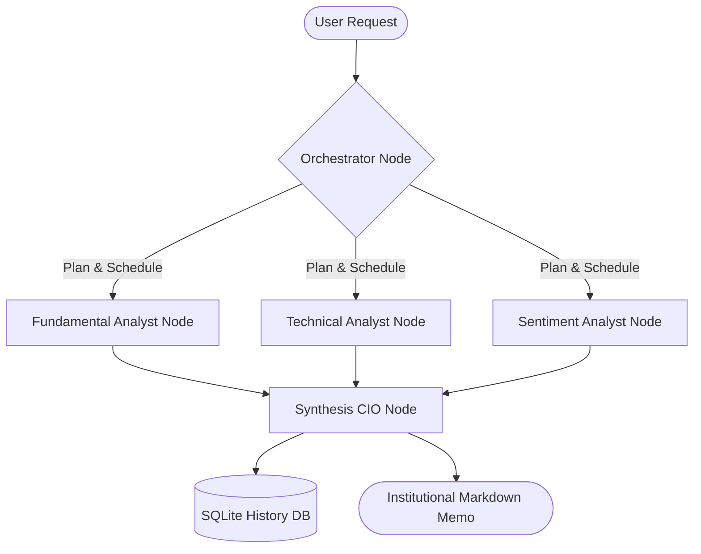

# FinAnalyst: Hierarchical Multi-Agent Financial Research & Stock Analysis System

[](https://www.python.org/)
[](https://github.com/langchain-ai/langgraph)
[](tests/)
[](LICENSE)

FinAnalyst is a production-grade, hierarchical multi-agent workspace designed to perform automated financial research, technical charting, and market sentiment analysis for stocks. Built on top of **LangGraph**, the system orchestrates multiple specialized AI agents under a Chief Investment Officer (CIO) node to deliver institutional-grade research memos and investment recommendations (BUY/SELL/HOLD).

This project features a clean **Hexagonal Architecture (Ports & Adapters)**, advanced API rate-limit resilience, bilingual localization, and a comprehensive local caching layer to ensure speed, scalability, and cost efficiency.

---

## 🤖 Multi-Agent Graph Architecture

The workflow is modeled as a state machine using LangGraph, coordinating the following specialized nodes:



1.  **Orchestrator Agent**: Parses the user request, validates the ticker symbol, and schedules the execution of specialist agents based on the selected mode (`full`, `fundamental`, or `technical`).
2.  **Fundamental Specialist (PDF RAG)**: 
    *   Fetches stock metrics (P/E, ROE, P/B, EPS) dynamically.
    *   Ingests uploaded quarterly/annual PDF reports, parses them (using PyPDF/LlamaParse), indexes them into a local persistent **ChromaDB** vector store, and runs a semantic search RAG pipeline to extract key balance-sheet details.
3.  **Technical Specialist**: Computes moving averages (MA20, MA50), RSI, and MACD indicators on price history, generating trend signals.
4.  **Sentiment Specialist**: Scrapes CafeF news headlines, runs sentiment scoring via a local **FinBERT** pipeline, and compiles market confidence metrics.
5.  **Synthesis CIO Agent**: Reviews specialist insights, resolves conflicting signals, makes the final recommendation (BUY, SELL, or HOLD), compiles the markdown memo, and persists it into the SQLite history database.

---

## 🌟 Key Technical Features

### 1. Hexagonal Architecture (Ports & Adapters)
Core domain models and interfaces (Ports) are strictly decoupled from infrastructure details (Adapters). This ensures that database layers, LLM providers, and charting libraries can be swapped out seamlessly without affecting core business logic.

### 2. Multi-Key Load Balancing & Fallback Resilience
Designed for API key quota limitations:
- **Random Load Balancing**: Sequence shuffles user native Gemini API keys to distribute quota.
- **Automated Fallback**: Intercepts `429 (Rate Limit)` or quota errors and sequentially retries using the next available key.
- **Provider Redundancy**: Supports native Google AI Studio client fallback to OpenAI-compatible `9router` proxy endpoints.

### 3. Local SQLite Caching & Performance Tuning
To avoid redundant web scraping and API costs, local SQLite cache repository tables handle:
- **Stock Prices & Ratios Cache** (4-hour expiration TTL)
- **CafeF Scraped News Cache** (24-hour expiration TTL)
- **Conversational State Checkpointing** (via LangGraph SQLiteSaver)

### 4. Premium SaaS UI Dashboard
- **Glassmorphic Slate Design**: Beautiful dark UI built using Streamlit with custom CSS.
- **Bilingual Interface**: Toggle both UI text and LLM generated reports between **Tiếng Việt** and **English**.
- **Interactive Plotly Charts**: Visualizes candlesticks, moving averages, RSI bands, and MACD histograms.
- **Gemini-Style Sidebar**: A clean list of clickable recent chat links with inline deletion buttons and red-hover styles.

---

## 📂 Project Structure

```
├── .agents/                 # Behavioral guidelines and coding rules
├── data/                    # SQLite databases (gitignored) and PDF uploads
├── src/
│   ├── domain/              # Core Domain model schemas and Interfaces (Ports)
│   ├── infrastructure/      # Concrete Adapters (Gemini, ChromaDB, VnStock, CafeF, FinBERT)
│   ├── agents/              # LangGraph workflow definitions, nodes, and LLM prompts
│   └── ui/                  # Streamlit dashboard layout and Plotly visualizations
├── tests/                   # Systematic pytest suite (unit & integration tests)
├── .env.example             # Documented template for configuration settings
├── .gitignore               # Ignored credentials, data folders, and caches
└── requirements.txt         # Core project dependencies
```

---

## 🚀 Installation & Local Setup

### 1. Clone the Repository
```bash
git clone https://github.com/nvfus12/financial-analysis-agents.git
cd financial-analysis-agents
```

### 2. Setup Virtual Environment
```bash
python -m venv venv
venv\Scripts\activate   # On Windows
source venv/bin/activate # On Unix/macOS
```

### 3. Install Dependencies
```bash
pip install -r requirements.txt
```

### 4. Configure Environment Variables
Copy `.env.example` to `.env` and fill in your keys:
```bash
cp .env.example .env
```
*Key configurations inside `.env`:*
```env
# Gemini API Key (Support comma-separated keys for load balancing)
GEMINI_API_KEYS="your_key_1,your_key_2"
PRIMARY_PROVIDER="gemini" # or 9router

# Models Configuration
LLM_MODEL_NAME_FLASH="gemini-2.5-flash"
LLM_MODEL_NAME_PRO="gemini-2.5-pro"
LLM_MODEL_NAME_EMBEDDING="models/gemini-embedding-2"
```

### 5. Launch the Dashboard
```bash
python -m streamlit run src/ui/app.py
```
Open `http://localhost:8501` in your browser. 

> [!NOTE]
> **Automatic Database Initialisation**: The application features an auto-migration engine. On startup, it checks for the SQLite database configuration and automatically creates the schema tables at `data/finanalyst.db`. No manual database creation scripts are required!

---

## 🧪 Testing & Verification

### 1. Run Unit Tests (Pytest)
To verify financial formulas and caching layers:
```bash
python -m pytest tests/
```

### 2. Run Full CLI Integration Test
To run a complete end-to-end multi-agent LangGraph analysis directly in the terminal (performing PDF RAG, scraping, and compiling the CIO report for FPT):
```bash
python tests/run_full_system_test.py
```

---

## 📝 License
This project is licensed under the MIT License. See [LICENSE](LICENSE) for details.
